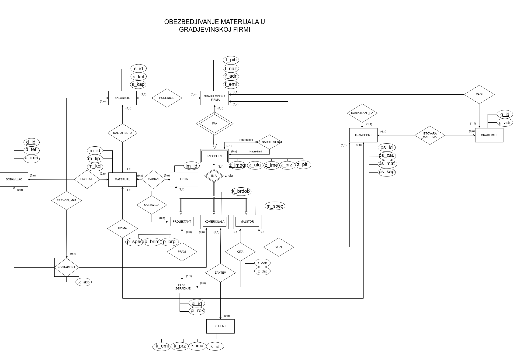

# Material Flow Manager

This project is a Command-Line Interface (CLI) application developed for the "Databases 2" course at the Faculty of Technical Sciences, Novi Sad. The application simulates a system for managing material procurement and logistics within a construction company.

It is built using Node.js and PostgreSQL, with a focus on a clean, layered architecture (DAO, DTO, Service, UI) to demonstrate robust software design principles.

## Project Foundation: The EER Model

The entire application is based on the Entity-Relationship model shown below, which defines the entities, attributes, and relationships within the construction company's domain. This model served as the blueprint for the PostgreSQL database schema.



### Detailed Documentation

A comprehensive description of the system, motivation, and a detailed breakdown of all entities and attributes is available in the original project documentation file.

[**Download Full Project Documentation (DOCX)**](docs/documentation.docx)

## Implemented Features

The CLI application provides an interactive menu to access various reports and perform key business operations. The following functionalities have been fully implemented.

### 1. Simple Reports

These reports provide quick, aggregated insights by joining two tables.

*   **Average Salary by Specialization:**
    *   **Description:** Calculates and displays the average salary for each craftsman (`Majstor`) specialization (e.g., "Zidar," "Keramicar").
    *   **Purpose:** This helps management understand labor costs and compensation structures across different skill sets.

*   **Employee Count by Company:**
    *   **Description:** Shows the total number of employees for each construction company registered in the database.
    *   **Purpose:** Provides a high-level overview of the workforce size for each business entity.

### 2. Complex Reports

These reports demonstrate advanced SQL capabilities by joining 3-5 tables and using a combination of filtering (`WHERE`), grouping (`GROUP BY`), group filtering (`HAVING`), and sorting (`ORDER BY`).

*   **Active Vehicles Report:**
    *   **Description:** Generates a detailed list of all transport vehicles that are currently assigned to a craftsman whose salary exceeds 60,000. The report includes the vehicle ID, company name, the driver's full name, their specialization, and salary, sorted by the driver's salary in descending order.
    *   **Purpose:** An operational report for fleet and HR managers to identify key personnel assigned to critical assets.

*   **Company Statistics Report:**
    *   **Description:** Provides a strategic overview of each company that employs more than 2 craftsmen. For each qualifying company, it calculates the total number of employees, the total number of craftsmen, and the average vehicle capacity.
    *   **Purpose:** A high-level analytical report for senior management to compare the operational capacity and structure of different companies.

### 3. Database Transaction

This feature demonstrates an atomic operation to ensure data integrity and consistency across multiple tables.

*   **Hire New Worker and Assign Vehicle:**
    *   **Description:** An interactive workflow that allows a user to hire a new craftsman. The application first prompts the user for the new employee's details (JMBG, name, salary, specialization, etc.) with real-time validation. It then finds the first available transport vehicle. Within a single database transaction, it:
        1.  Inserts a new record into the `zaposleni` table.
        2.  Inserts a new record into the `majstor` table.
        3.  Updates the `transport` table to assign the vehicle to the new craftsman.
    *   **Integrity:** If any of these steps fail (e.g., if there are no available vehicles), the entire transaction is rolled back, ensuring that no partial data is left in the database.

---

## Technical Stack & Architecture

*   **Backend:** Node.js
*   **Database:** PostgreSQL
*   **Database Driver**: `pg (node-postgres)` library used to connect the Node.js application to the PostgreSQL database.
*   **CLI Interface:** `inquirer` library for interactive menus.
*   **Architecture:**
    *   **UI Handler:** Manages all user interaction.
    *   **Service Layer:** Contains business logic.
    *   **DAO (Data Access Object):** Manages all database communication and SQL queries.
    *   **DTO (Data Transfer Object):** Structures data for transfer between layers.

## Setup and Installation

1.  **Prerequisites:**
    *   Node.js (v16+)
    *   PostgreSQL

2.  **Clone & Install:**
    ```bash
    git clone https://github.com/your-username/Material-Flow-Manager.git
    cd Material-Flow-Manager
    npm install
    ```
     
3.  **Run the Application:**
    *   The following command will initialize the database (create tables and seed data) and launch the interactive menu.
    ```bash
    npm start
    ```
